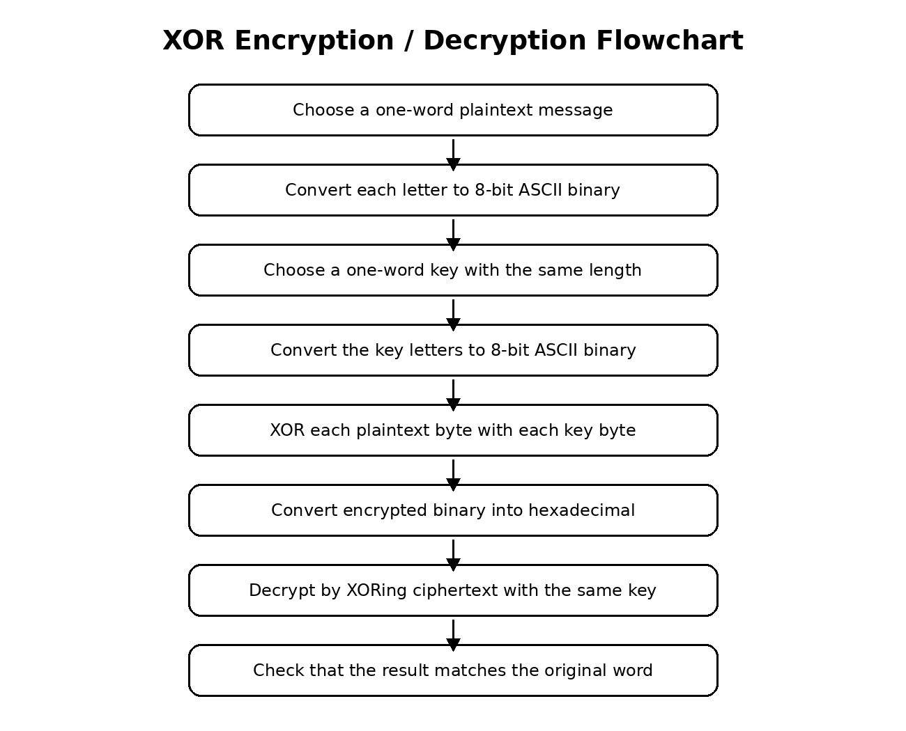
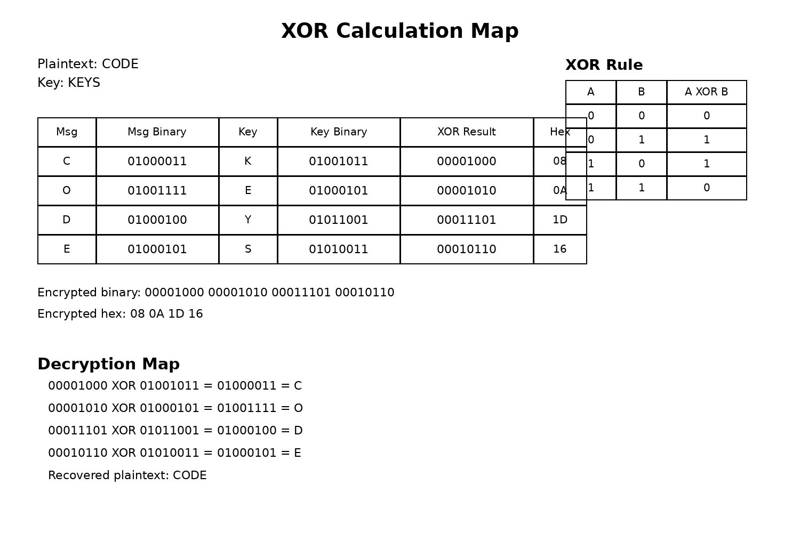

# Encyption-decryption-using-XOR

## Objective

The goal of this lab was to show how XOR can be used to encrypt and decrypt a short message.

## Images / Maps

Flowchart:



XOR calculation map:



## Message and Key

Plaintext message: CODE

Secret key: KEYS

I used a message and key with the same length so each letter could be XORed with one key letter.

## ASCII Binary

Message:

C = 01000011  
O = 01001111  
D = 01000100  
E = 01000101  

Key:

K = 01001011  
E = 01000101  
Y = 01011001  
S = 01010011  

## XOR Rule

0 XOR 0 = 0  
0 XOR 1 = 1  
1 XOR 0 = 1  
1 XOR 1 = 0  

## Encryption Work

C XOR K:

```text
01000011
01001011
--------
00001000
```

O XOR E:

```text
01001111
01000101
--------
00001010
```

D XOR Y:

```text
01000100
01011001
--------
00011101
```

E XOR S:

```text
01000101
01010011
--------
00010110
```

Encrypted binary:

```text
00001000 00001010 00011101 00010110
```

Encrypted hexadecimal:

```text
08 0A 1D 16
```

## Decryption Work

To decrypt, I XORed the encrypted binary with the same key.

```text
00001000 XOR 01001011 = 01000011 = C
00001010 XOR 01000101 = 01001111 = O
00011101 XOR 01011001 = 01000100 = D
00010110 XOR 01010011 = 01000101 = E
```

Decrypted message:

```text
CODE
```

The decrypted message matches the original plaintext.

## Different Plaintext and Key Lengths

If the plaintext and key have different lengths, the key can be repeated until it matches the length of the plaintext. For example, if the message is HELLO and the key is KEY, the repeated key would be KEYKE. Then XOR can be done character by character.

## Challenges

The hardest part was making sure the ASCII binary values were correct and keeping each row lined up while doing the XOR. Another challenge was converting the encrypted binary into hexadecimal without mixing up the values.
